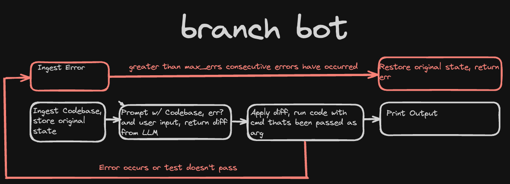

# blend

llm tool that ingests codesbases, applies diffs, runs the code.

## design

## dev

### environment vars

inside the go environment, env var files are loaded in the order of .env.public, then .env.mine with override behaviour, so you can clone the repo and use the .env.public variables for local dev and customize them in .env.mine

.env.test is also available and committed for env vars that should only be used in tests.
